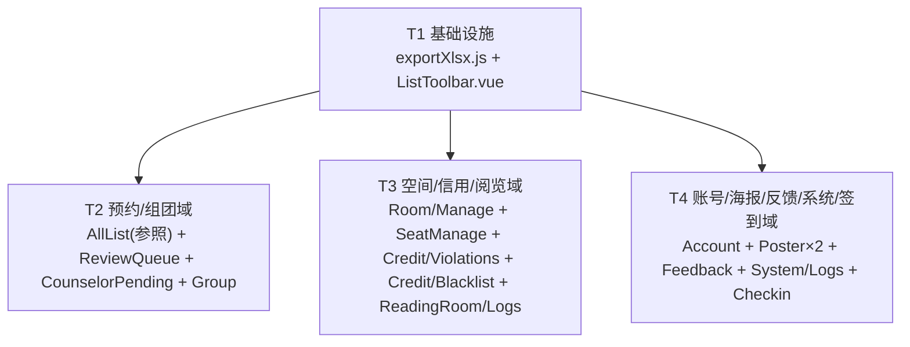
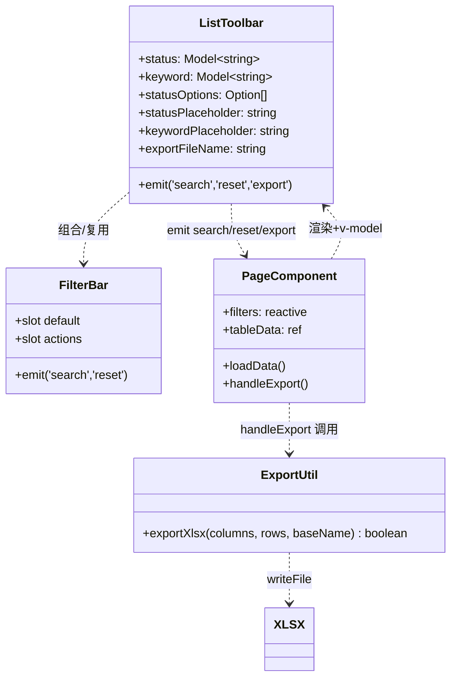
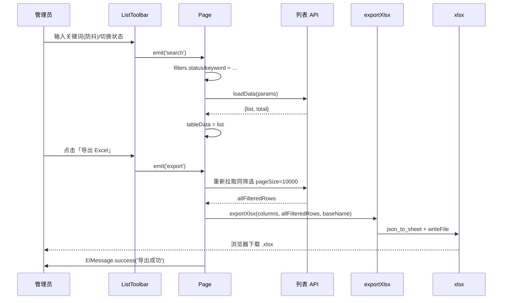

# 列表工具条与 Excel 导出 — 架构设计与任务分解

> 适用范围：敬一书院功能房预约系统 · 管理前端（`admin`，Vue 3 + Vite + Element Plus）
> 目标：遍历全部管理员列表页，按需补充「状态筛选下拉 / 关键词搜索 / 导出 Excel(.xlsx)」，统一为可复用组件，降低重复代码、提升日常运营效率。
> 依赖现状：`xlsx`(SheetJS ^0.18.5) 已是 `package.json` 依赖；`src/utils/request.js` 为统一 axios 实例；`src/utils/requestErrorPolicy.js` 支持 `silentError` 标志；`src/components/admin/FilterBar.vue` 提供 `@search`/`@reset` 与默认插槽 / `#actions` 插槽。

---

## 0. 设计结论速览

- **新增 1 个工具函数** `src/utils/exportXlsx.js`：纯函数，接收列定义 + 行数据 + 文件名基准，用 `xlsx` 生成真实 `.xlsx` 并触发浏览器下载（自动追加 `_YYYY-MM-DD`）。
- **新增 1 个组件** `src/components/admin/ListToolbar.vue`：组合 `FilterBar`，内置「状态 `el-select`（可选）+ 关键词 `el-input`（防抖）+ 导出 Excel 按钮（可选）」，通过 `v-model:status` / `v-model:keyword` 与页面 `filters` 双向绑定，对外仅暴露 `@search` / `@reset` / `@export` 三个事件。
- **改造 15 个列表页**：统一接入 `ListToolbar`；其中 `Reservation/AllList.vue` 作为参照实现，移除其内联的 `XLSX` 导出逻辑，改为调用 `exportXlsx`。
- **导出范围约定**：分页页 → 用相同筛选条件「重新拉取 `pageSize=10000`」后导出**筛选后全量**；非分页页（座位/位置）→ 导出当前已加载行。
- **隐私（R-14）约定**：导出**仅使用页面已加载、且屏幕上已展示（后端已脱敏）的行对象**；绝不为导出调用任何「解掩码」接口；导出列引用与表格相同的 `row` 字段，状态类字段用页面既有 label map 经 `formatter` 映射，不拼接/解密 PII。

---

## 1. 可复用组件设计

### 1.1 工具函数 `src/utils/exportXlsx.js`

```js
// src/utils/exportXlsx.js
import * as XLSX from 'xlsx'
import { ElMessage } from 'element-plus'

/**
 * 将行数据导出为真实 .xlsx 并触发浏览器下载。
 * @param {Array<{header:string, key:string, width?:number, formatter?:(row:any)=>any}>} columns
 *         header: 表头中文；key: 行对象字段名；width: 列宽(wch)，缺省按表头长度*2；
 *         formatter: 可选，状态/枚举→中文标签、日期格式化等。
 * @param {Array<any>} rows  导出的行对象数组（建议为「筛选后全量」）
 * @param {string} baseName  文件名基准，如 "导出_预约列表"（自动追加 _YYYY-MM-DD.xlsx）
 * @returns {boolean} 是否成功触发下载
 */
export function exportXlsx(columns, rows, baseName) {
  if (!rows || !rows.length) {
    ElMessage.warning('暂无数据可导出')
    return false
  }
  const exportRows = rows.map(row => {
    const r = {}
    for (const col of columns) {
      r[col.header] = col.formatter ? col.formatter(row) : (row?.[col.key] ?? '')
    }
    return r
  })
  const ws = XLSX.utils.json_to_sheet(exportRows)
  ws['!cols'] = columns.map(c => ({ wch: c.width || Math.max(10, (c.header ? c.header.length : 8) * 2) }))
  const wb = XLSX.utils.book_new()
  XLSX.utils.book_append_sheet(wb, ws, '导出数据')
  const date = new Date().toISOString().slice(0, 10)
  XLSX.writeFile(wb, `${baseName}_${date}.xlsx`) // 现代浏览器均支持中文文件名；如需更强兼容可改 Blob+anchor+encodeURIComponent
  return true
}
```

要点：
- 使用 `import * as XLSX from 'xlsx'`（静态引入，tree-shake 由 Vite 处理）；与 `AllList.vue` 现有 `await import('xlsx')` 行为一致，但更简洁。
- **必须产出真实 `.xlsx`**：`XLSX.writeFile` 在浏览器中生成 Blob 并触发 `<a download>` 下载，符合需求。
- 函数为「纯下载」：空数据提示、成功提示由**调用方**在 `@export` 处理函数中负责（保持函数可单测），成功提示统一 `ElMessage.success('导出成功')`。

### 1.2 组件 `src/components/admin/ListToolbar.vue`

组合 `FilterBar`，把「状态下拉 + 关键词输入」放进默认插槽，「导出按钮」放进 `#actions` 插槽；自身仅做防抖与事件透传。

**Props**

| Prop | 类型 | 默认 | 说明 |
|------|------|------|------|
| `statusOptions` | `Array<{label,value}>` | `undefined` | 非空时渲染状态 `el-select`；为空/未传则不渲染 |
| `statusPlaceholder` | `string` | `'状态'` | 状态下拉占位 |
| `keywordPlaceholder` | `string` | `''` | 非空时渲染关键词 `el-input`；为空则不渲染 |
| `exportFileName` | `string` | `''` | 非空时渲染「导出 Excel」按钮；为空则不渲染 |

**v-model**：`v-model:status`、`v-model:keyword`（直接绑定页面 `filters`，作为单一数据源）

**Events**：`search`（状态变更 / 关键词防抖(300ms) / FilterBar「查询」按钮）、`reset`（FilterBar「重置」）、`export`（点击导出按钮）

**插槽**：默认插槽（额外的筛选控件，如日期范围 / 功能房 / 类型）、`#actions`（额外操作按钮，置于导出按钮之前）

```vue
<!-- src/components/admin/ListToolbar.vue（骨架） -->
<template>
  <FilterBar @search="emit('search')" @reset="emit('reset')">
    <el-select
      v-if="statusOptions && statusOptions.length"
      v-model="status" :placeholder="statusPlaceholder" clearable style="width: 140px"
      @change="emit('search')"
    >
      <el-option v-for="o in statusOptions" :key="o.value" :label="o.label" :value="o.value" />
    </el-select>

    <el-input
      v-if="keywordPlaceholder"
      v-model="keyword" :placeholder="keywordPlaceholder" clearable style="width: 200px"
      @keyup.enter="emit('search')"
    />

    <slot />

    <template #actions>
      <slot name="actions" />
      <el-button v-if="exportFileName" type="success" @click="emit('export')">
        <el-icon><Download /></el-icon>导出 Excel
      </el-button>
    </template>
  </FilterBar>
</template>

<script setup>
import { watch, onBeforeUnmount } from 'vue'
import FilterBar from './FilterBar.vue'

const status = defineModel('status')
const keyword = defineModel('keyword')
const props = defineProps({
  statusOptions: { type: Array, default: undefined },
  statusPlaceholder: { type: String, default: '状态' },
  keywordPlaceholder: { type: String, default: '' },
  exportFileName: { type: String, default: '' }
})
const emit = defineEmits(['search', 'reset', 'export'])

let timer
watch(keyword, () => {
  clearTimeout(timer)
  timer = setTimeout(() => emit('search'), 300) // 关键词输入防抖后触发查询
})
onBeforeUnmount(() => clearTimeout(timer))
</script>
```

**页面最小用法（以 `Room/Manage.vue` 为例）**

```vue
<ListToolbar
  v-model:status="filters.status"
  v-model:keyword="filters.keyword"
  :status-options="[{ label: '开放', value: 'open' }, { label: '关闭', value: 'closed' }, { label: '维护中', value: 'maintenance' }]"
  keyword-placeholder="搜索名称/描述"
  export-file-name="导出_功能房列表"
  @search="loadData"
  @reset="resetFilters"
  @export="handleExport"
/>

<!-- 额外筛选（功能房/类型/楼栋）放进默认插槽，变更后由页面决定 @change="loadData" 或点「查询」 -->
```

`@export` 处理函数（各页统一模板）：

```js
async function handleExport() {
  try {
    const res = await getList({ ...filters, page: 1, pageSize: 10000 }) // 重新拉取筛选后全量
    const list = res.data?.list || []
    if (!exportXlsx(exportColumns, list, '导出_功能房列表')) return
    ElMessage.success('导出成功')
  } catch (e) {
    ElMessage.error('导出失败，请重试')
  }
}
```

---

## 2. 页面盘点与逐页规格

> ✅=本批接入；⚠️=含 PII（R-14）；🔧=关键词/状态后端不支持，需前端兜底。

| # | 页面（文件） | 列表 API | 状态筛选(statusOptions) | 关键词字段 | 导出列（建议） | PII | 后端过滤支持 | 备注 |
|---|------|------|------|------|------|------|------|------|
| 1 | Reservation/AllList.vue ✅⚠️ | `getAll`(`/reservation`) | 9 项预约状态* | 姓名/学号 | 预约人,学号,功能房,预约日期,时间段,状态,用途,创建时间 | 学号 | ✅ status+keyword | **参照实现**：移除内联 XLSX，改用 ListToolbar+exportXlsx；状态 formatter 用 `@/utils/reservationStatus` 的 `reservationStatusLabel` |
| 2 | Reservation/ReviewQueue.vue ✅⚠️🔧 | `getPending(type:'admin')` | —（队列即待审） | 预约人/学号🔧 | 预约人,学号,功能房,预约日期,时间段,用途,提交时间 | 学号 | 🔧 keyword 不支持 | 状态下拉不渲染；关键词前端过滤已加载 `tableData` |
| 3 | Reservation/CounselorPending.vue ✅⚠️🔧 | `getCounselorPending` | — | 学生姓名/学号🔧 | 学生姓名,学号,功能房,预约日期,时间段,用途,辅导员 | 学号 | 🔧 keyword 不支持 | 同上；保留 buildingId/date 于默认插槽 |
| 4 | Group/PendingList.vue ✅⚠️🔧 | `listPending` | 审批状态(pending/counselor_pending/approved/rejected/cancelled)🔧 | 发起人/标题🔧 | 组团标题,发起人,功能房,日期,时间段,人数,审批状态 | 发起人 | 🔧 均不支持 | 状态/关键词均前端过滤 |
| 5 | ReadingRoom/Logs.vue ✅⚠️🔧 | `getHistory` | 在阅/已离开 | 学号/姓名🔧(name) | 姓名,学号,进入时间,离开时间,停留时长,座位号,状态 | 姓名/学号 | ✅ date+studentId；name🔧 | name 前端过滤；导出用 `getHistory(pageSize:10000)` |
| 6 | Room/Manage.vue ✅ | `getList(rooms)` | 开放/关闭/维护中 | 名称/描述 | 名称,类型,楼栋,楼层,容量,状态,描述 | — | ✅ | 直接接入；状态/类型/楼栋已在 filters |
| 7 | Room/SeatManage.vue ✅ | `getSeats` | 可用/停用/维护中 | 座位号🔧 | 座位号,行,列,状态,电源 | — | 🔧 仅 roomId | 非分页(200)；导出当前已加载；状态前端过滤 |
| 8 | Credit/Violations.vue ✅⚠️ | `getViolations` | —（用 type 作类目筛选） | 学号 | 学生姓名,学号,违规类型,描述,扣分,记录时间,操作人 | 学号 | ✅ type+studentId | 保留 type 下拉；不加冗余 status |
| 9 | Credit/Blacklist.vue ✅⚠️🔧 | `getBlacklist` | 封禁/受限/低信用🔧 | 学号/姓名 | 学生姓名,学号,信用分,状态,进入原因,处理时间,预计恢复,违规次数 | 学号 | ✅ keyword；status🔧 | 状态前端过滤；信用分/状态用既有 map |
| 10 | Poster/PendingList.vue ✅⚠️🔧 | `getPending(poster)`(`/poster`) | 待审核/已通过/已驳回 | 申请人/学号🔧 | 申请人,学号,海报标题,张贴位置,开始日期,结束日期,状态,申请时间 | 学号 | ✅ status；keyword🔧 | 状态 formatter 用页内 `statusMap` |
| 11 | Poster/PositionManage.vue ✅ | `getPositions` | 启用/停用 | —（可选名称） | 位置名称,所在楼栋,楼层,最大海报数,当前海报数,状态,描述 | — | —（pageSize 100） | 配置类小表；导出当前加载 |
| 12 | FeedbackView.vue ✅⚠️🔧 | `GET /feedback` | 待处理/已处理 | 用户/联系方式🔧 | 用户,类型,内容,联系方式,状态,提交时间 | 联系方式/用户 | ✅ status；keyword🔧 | 状态 formatter 用页内映射；关键词前端过滤 |
| 13 | System/Logs.vue ✅ | `getLogs` | —（用 category 作类目） | 操作人 | 操作人,具体操作,业务范围,操作对象,操作详情,来源记录,操作时间 | 内部(低敏) | ✅ operator+category+date | 保留 operator/category/date；不改 status |
| 14 | Account/Index.vue ✅⚠️ | `getList(accounts)` | 正常/停用·封禁/受限(+学生受限) | 账号/姓名/学号 | 学号(或账号),姓名,角色,状态,所属楼栋/管理范围,创建时间 | 姓名/学号 | ✅ keyword+role+status | **需随当前 tab（student/manager）切换导出列与 accountType** |
| 15 | Checkin/Manage.vue ✅⚠️🔧 | `getCurrentList` | —（均为在用） | 学号/姓名🔧 | 学生姓名,学号,功能房,座位号,签到时间,已用时 | 学号 | 🔧 仅分页 | 实时面板；关键词前端过滤当前列表 |

\* 预约状态 9 项（来自 `AllList.vue` / `@/utils/reservationStatus`）：`pending 待审核 / counselor_pending 辅导员审核 / approved 已通过 / rejected 已驳回 / checked_in 使用中 / completed 已完成 / noshow 已爽约 / cancelled 已取消`，外加可能的细分；导出 formatter 统一用 `reservationStatusLabel(row.status)`。

**明确排除**（本批不做）：
- `Stats/Overview.vue`：图表/仪表盘，无表格清单可导出。
- `Stats/Export.vue`：已是专门的「服务端导出报表」页（`exportData` 返回 blob），与逐页导出职责不重叠，保留。
- `Dashboard/Index.vue`、`Room/Monitor.vue`、`Room/RulesConfig.vue`、`System/Announcements.vue`、`System/Backup.vue`、登录/禁用页：非列表或无需导出。
- 候选但未纳入：`Room/BuildingManage.vue`（楼栋管理，亦为表格，可后续复用 `ListToolbar`，本批为控范围暂缓）。

---

## 3. 任务分解（有序 + 依赖）

> 命名为 **Batch 5（列表工具条 + Excel 导出）**，与既有 Batch0–4 衔接；QA 由 `software-qa-engineer` 单列验证。

| Task | 名称 | 涉及文件 | 依赖 | 优先级 |
|------|------|----------|------|--------|
| **T1** | 基础设施：新建 `exportXlsx.js` 与 `ListToolbar.vue` | `src/utils/exportXlsx.js`（新建）、`src/components/admin/ListToolbar.vue`（新建） | 无 | P0 |
| **T2** | 预约/组团域（含参照实现） | `Reservation/AllList.vue`（重构）、`Reservation/ReviewQueue.vue`、`Reservation/CounselorPending.vue`、`Group/PendingList.vue` | T1 | P0 |
| **T3** | 空间/信用/阅览域 | `Room/Manage.vue`、`Room/SeatManage.vue`、`Credit/Violations.vue`、`Credit/Blacklist.vue`、`ReadingRoom/Logs.vue` | T1 | P1 |
| **T4** | 账号/海报/反馈/系统/签到域 | `Account/Index.vue`、`Poster/PendingList.vue`、`Poster/PositionManage.vue`、`FeedbackView.vue`、`System/Logs.vue`、`Checkin/Manage.vue` | T1 | P1 |

依赖关系：**T2 / T3 / T4 均仅依赖 T1**，三者之间相互独立，可由不同工程师并行。



**T2 实施顺序建议**（建立模式后其余页照抄）：
1. `AllList.vue`：用 `ListToolbar` 替换手写 `el-form` 筛选区；`@export` 调 `exportXlsx`，移除内联 `XLSX.writeFile`；`exportColumns` 用 `reservationStatusLabel` 作状态 formatter。
2. 其余三页：加 `ListToolbar`（仅 keyword + export，不渲染 status），`@export` 重新拉取全量后导出；关键词前端过滤 `tableData`。

---

## 4. 共享约定 / 知识（供工程师遵循）

- **路径约定**：工具 `src/utils/exportXlsx.js`；组件 `src/components/admin/ListToolbar.vue`（与 `FilterBar.vue` 同目录，便于复用其样式 `.filter-bar`）。
- **xlsx 用法模式**：统一 `XLSX.utils.json_to_sheet → book_new → book_append_sheet → writeFile`；文件名基准 + 当日日期。禁止手写 CSV/HTML-table 下载。
- **`silentError` 约定**：列表加载若页面已自带错误态（如 `AsyncState` + `loadError`），调用 API 时传 `{ silentError: true }`（见 `AllList`/`System/Logs`/`FeedbackView`/`Room/Manage`）。导出拉取同样用 `silentError:true` 并在 `@export` 处理函数内 `try/catch` 给 `ElMessage.error('导出失败，请重试')`，避免全局重复 toast。
- **筛选状态归属**：状态/关键词作为页面 `filters` 的一部分（单一数据源），经 `v-model` 绑定到 `ListToolbar`；`resetFilters()` 同时清空 `filters` 与（由 v-model 联动的）组件内部值。暂不引入 URL 同步（现有页面均无），如需后续加，用 `vue-router` query，不在本批。
- **导出范围**：分页页 `@export` 内用**同筛选条件 + `pageSize:10000`** 重新拉取后导出「筛选后全量」；非分页页（座位/位置）导出已加载行。超大数据量（>数万行）建议改服务端导出（参考 `Stats/Export.vue`），本批不做。
- **R-14 隐私（关键）**：
  - 导出**只使用页面已加载、屏幕上已展示的行对象**（后端已在入口脱敏，见 `reservation.js` 轨迹接口注释「入口已脱敏」）。
  - `exportColumns` 的 `key` 必须与表格展示字段一致；状态/枚举用 `formatter` 映射既有 label map，**绝不拼接、解密或调用解掩码接口**。
  - 含 PII 的页（表内 ⚠️）：`AllList / ReviewQueue / CounselorPending / Group / ReadingRoom/Logs / Credit/Violations / Credit/Blacklist / Poster/PendingList / Account/Index / Checkin/Manage / FeedbackView`。这些页导出的是后端返回的（已脱敏）值；若某列表接口返回的是**明文**学号/姓名，则导出即泄露——见第 5 节风险，需先与后端/ gap-analysis 确认。
  - 下载得到的 `.xlsx` 本身是 PII 载体，落地后按数据管理制度保管（前端范围外，但实现时提醒运营）。

---

## 5. 风险与待确认（Open Questions）

1. **后端过滤能力缺口（🔧，影响 T2/T3/T4 多页）**
   - `getPending`(`/audit/pending`)、`getCounselorPending`、`listPending`(`/groups/pending`)：**不支持 keyword** → 关键词只能前端过滤已加载 `tableData`。
   - `getBlacklist`：仅支持 `keyword`，**不支持 status** → 状态前端过滤。
   - `getHistory`：支持 `studentId` 但不支持按 `name` 搜 → 姓名前端过滤。
   - `getCurrentList`(`/checkin/status/0`)、`GET /feedback`：仅分页/status，**不支持 keyword** → 前端过滤。
   - `poster GET /poster`：status 支持，keyword 待确认。
   - **决策**：本批统一采用「前端过滤兜底」（对当前页/已加载数据做 `computed filteredRows`，导出也基于它）；同时建议后端补齐 keyword 参数（列入后续需求）。若产品要求「跨页关键词搜索」，则必须后端支持。

2. **导出「当前页 vs 筛选后全量」**：已约定「筛选后全量（pageSize=10000）」。需与产品确认阈值与超限（>1 万行）是否改服务端导出。

3. **R-14 掩码确认（最高优先级）**：需确认上述 ⚠️ 页的列表接口在「导出场景」下返回的是否已是脱敏值。若明文，则逐页导出 studentId/realName 违反隐私策略 → 须先由后端对导出场景脱敏，或前端导出前对 PII 字段做掩码（如 `张*`、`2021****1234`），**但前端掩码会与服务端展示不一致，不推荐**；优先推动服务端脱敏。

4. **中文文件名下载兼容**：`XLSX.writeFile` 在现代 Chromium/Firefox 下中文文件名正常；若测试发现旧浏览器异常，改为 `XLSX.write` 取 buffer → `Blob` + `<a download="encodeURIComponent(name)">`。本批先用 `writeFile`。

5. **`Account/Index.vue` 双 Tab 导出**：导出列随 `activeTab`（student/manager）不同；`@export` 需按当前 tab 拼 `accountType` 并选择对应 `exportColumns`，且管理员角色列需隐藏学生专属列。

6. **Group/PendingList 成员 PII**：详情抽屉内含成员姓名/学号，但**列表导出不含成员明细**（仅组团级字段），故不触发成员 PII 导出；如需成员级导出单列需求，另议。

7. **职责重叠**：`AllList` 的客户端导出与 `Stats/Export.vue` 的「预约记录报表」服务端导出功能重叠。定位区分：逐页导出=管理员对「当前筛选视图」的快捷导出；Stats/Export=按类型/时间范围的批量报表。两者共存，不互斥。

---

## 附：交互时序与类关系（Mermaid）

### 类关系



### 导出时序


