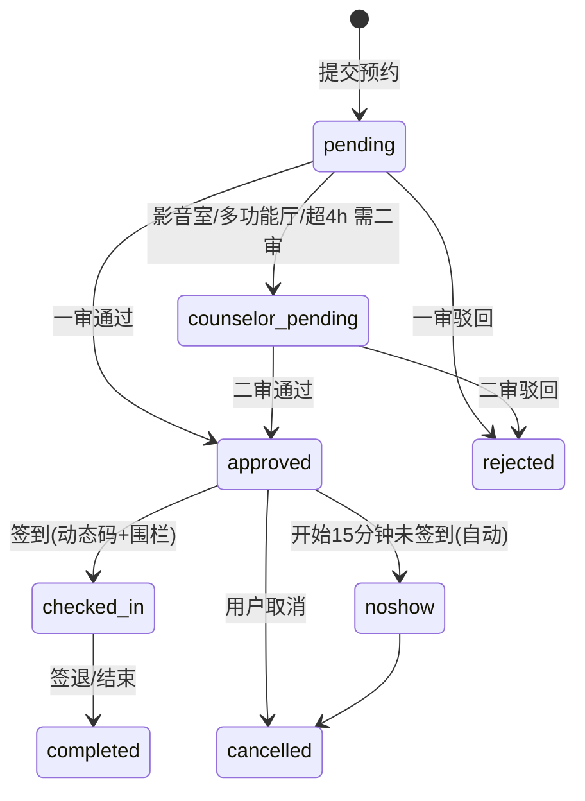
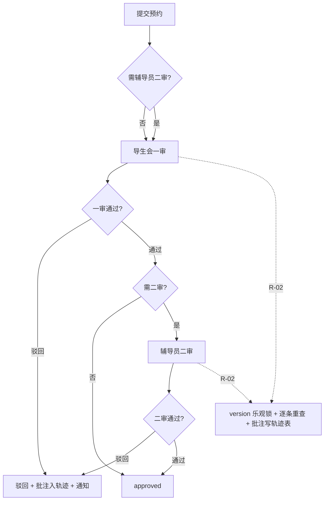
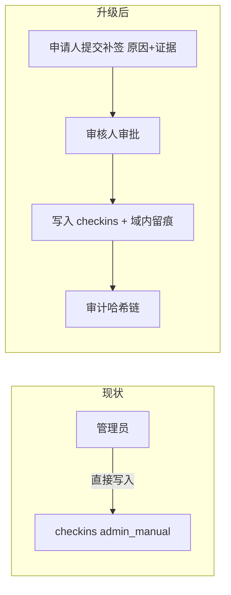
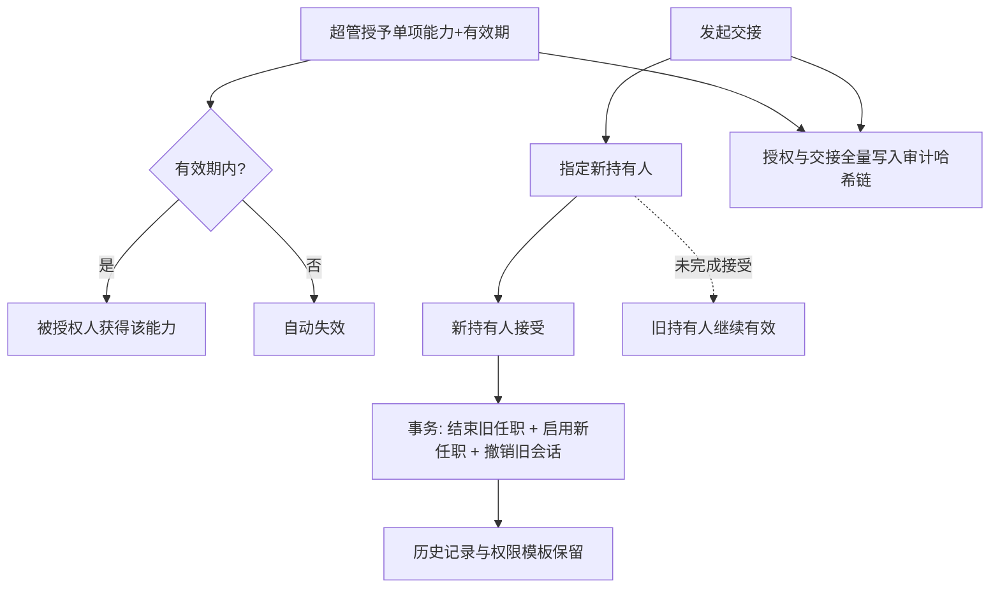

# 敬一书院功能房预约系统 · 升级方案（PRD）

> **文档版本：v2（基于最新实际代码重新设计）**
> 编制角色：产品经理（许清楚 / Xu）　｜　编制日期：2026-09
> **代码基线**：`D:\敬一书院\jingyi-reservation-system`（后端 `server/src/`、管理端 `admin/`、小程序 `miniapp/`、迁移 `server/sql/migrations/`，最新 `20260909_group_reservation.sql`）
> 借鉴对象：工学院青年志愿者服务平台 `D:\工青协\volunteer-platform`（仅用于填补**真实缺口**）
> 说明：本版所有"已具备 / 缺口"结论均经**实际读取源码与迁移脚本**核实，逐项附代码证据。

---

## 〇、本版修正了 v1 的错误基线

| 项 | v1（错误） | v2（修正后） |
|---|---|---|
| 基线叙事 | 假设系统处于"从零补齐"状态，按"原方案 − 已实现项"裁剪 | 以真实代码库为基线，先准确描述现状，再谈"下一步往哪进化" |
| 权限模型 | 称"openid+学号+role 混在一张 users 表，需三分离重构" | **误判**：`admins` 表已与 `users` 分离，且已有 `scope_type(global/building)` 多维判定（`utils/adminScope.js` + 迁移 `20260712`）。真实缺口仅为**临时授权与岗位交接** |
| 通知可靠投递 | 列为待建（R-03） | **误判**：`notification_outbox`（attempts/max_attempts=8/dead/locked_by）+ pump 租约 + dispatcher 已完整实现（迁移 `20260625`）。本版移入"已具备能力" |
| 冲突与候补 | 列"候补转正无原子事务"（R-04） | **误判**：`promoteWithinTransaction` 已用 `FOR UPDATE` + 幂等键 + `SLOT_CONFLICT/WAITLIST_RACE` 处理。移入"已具备能力" |
| 审计 | 称"审计不足，需增强"（R-13） | **误判**：`auditTrailService` 已实现哈希链（`prev_hash`/`entry_hash`）+ 盐哈希 `ip_hash` + `actor_role` + 可验证接口。移入"已具备能力" |
| 需求池 | 含多个已实现项 | 仅保留**读码确认的真实缺口**（R-02/05/06/07/08/09/10/11/12/14/15/16 + 新增 R-17） |
| 优先级 | 按 v1 假设排 | 按**这套系统的真实价值**重排：隐私脱敏（合规风险）上提至 P1，临时授权（换届刚需）上提至 P1 |

---

## 一、现状：这套系统现在长什么样（读码核实）

### 1.1 架构事实

| 层 | 位置 | 关键事实 |
|---|---|---|
| 后端 | `server/src/` | controllers / services / middleware / routes / utils / config 分层清晰 |
| 迁移 | `server/sql/migrations/` | 至 `20260909_group_reservation.sql`，配 `apply-*-migration.js` 预检脚本，幂等 |
| 管理端 | `admin/` | Vue3 + Vite + Element Plus + Pinia + echarts |
| 小程序 | `miniapp/` | 原生，含管理端页面（注意：非架构文档所写 `admin-web/`、`miniprogram/`） |

### 1.2 已具备的六项核心能力（附代码证据）

| # | 能力 | 代码证据 | 现状评价 |
|---|---|---|---|
| **A1** | **通知可靠投递** | `notification_outbox` 表：`status(pending/processing/sent/failed/dead)`、`attempts`、`max_attempts=8`、`locked_by/locked_at`、`last_error`、`dedupe_key` 唯一键（迁移 `20260625`）；`notificationOutboxPumpService.js` 维护 `workerId` 租约与 `activeTick` 防重入；`notificationOutboxDispatcher.js` 统计 `sent/failed/dead/leaseLost` | **已完整**（对标工青协 outbox 范式，无需重建） |
| **A2** | **预约冲突与候补一致性** | `reservationLifecycleService.promoteWithinTransaction`：`SELECT ... FOR UPDATE` + 幂等键 `waitlist:{id}` + 捕获 `SLOT_CONFLICT/WAITLIST_RACE/IDEMPOTENCY_CONFLICT` + 无效候补自动 `expired` 重试；`detectNoshow` 15 分钟超时判爽约 | **已完整**（唯一键 `uk_room_seat_date_minute` + 事务化转正） |
| **A3** | **多维权限** | `admins.scope_type ENUM('global','building')`（迁移 `20260712`，super_admin/counselor 自动 global）；`utils/adminScope.js` 归一化角色与楼栋域；`middleware/adminScope.js` 逐请求装载 | **已具备**（角色 + 楼栋数据域二维） |
| **A4** | **审计哈希链** | `auditTrailService.js`：`prev_hash/entry_hash` 链式哈希 + `GET_LOCK` 串行化追加 + `ip_hash`（盐 SHA256）+ `actor_role` + 凭据类字段 `[redacted]` + `verifyRows/verifyRecent` 可验证 | **已完整**（强于工青协审计要求） |
| **A5** | **签到动态凭证** | `checkinCredentialService.js`：HMAC-SHA256 滚动码（`v1`、TTL 30–90s）、Redis Lua **原子消费** nonce、区分 `expired/stale/replayed`、生产环境强校验密钥与非 mock Redis | **已完整**（防截图/防重放/防旧码） |
| **A6** | **组团预约 + 统一响应** | `reservationGroupController` + 迁移 `20260909`（status 含 `counselor_pending`、max_members 等）；`utils/response.js` 提供 `success/error/paginate` 统一结构 | **已具备** |

> 另有：`distributedLockService.js`、`reservationMutationService.js`（`FOR UPDATE`）、`realtimeEventService`/`socketRedisAdapterService`（WebSocket 跨实例广播）。

### 1.3 真实缺口盘点（读码确认）

| 缺口 | 核实方式 | 结论 |
|---|---|---|
| 临时授权 / 岗位交接 | 全库 grep `delegate\|临时授权\|handover\|交接\|takeover` → **0 命中** | **完全空白** |
| 隐私脱敏（业务层） | `utils/reservationPresenter.js` 直出 `studentId`（`student_id/student_no`）、`userName` 明文；审计仅 redact 凭据类（password/token/openid），**不遮业务字段** | **完全空白（合规风险）** |
| 地理围栏 | 全库 grep `geo\|围栏\|latitude\|longitude` → 仅 `.flat()`/无关命中 → **0 真实命中** | **完全空白**（动态码已就绪，缺围栏） |
| 智能推荐 | 全库 grep `recommend\|推荐\|智能匹配\|matching` → **0 命中** | **完全空白** |
| 审核乐观锁 / 批注轨迹 | 无 `version` 列（grep 无行级乐观锁）；依赖 `WHERE status=?` 条件更新；批注仅 `reject_reason` 单字段，**无审核轨迹表** | **半成品** |
| 补签留痕 | `manualCheckin` 存在：管理员**直接写入** `checkins(checkin_type='admin_manual')`，含事务与 `FOR UPDATE`，HTTP 层有审计，但**无申请→审核→域内留痕**（无审批人/原因/工单） | **半成品** |
| 稳定错误码字典 | `response.js` 有结构，但错误以 `message` 为主、`code` 复用 HTTP 状态，**无业务错误码字典** | **半成品** |
| 用户端审核轨迹展示 | 后端 `counselor_pending` 与 `reject_reason` 就绪；小程序端是否完整展示一/二审轨迹**未验证** | **待前端确认** |
| 大型活动手动录取 | 辅导员二审已实现（`reservationApprovalController` 含 `counselor_pending`），但"满员时人工挑选录取"**未见实现** | **待确认** |
| 前端一致性 | v1.1 的 7 项 P1–P3（每页条数、空态/错误态、KPI 表达、状态色相、错误语义、行 hover、写操作权重） | **待前端确认** |

---

## 二、改造目标

### 2.1 借鉴映射表（只填真实缺口，不重复"借鉴"已实现项）

| 工青协范式 | 出处 | 本系统落点（真实缺口） | 借鉴什么 / 怎么借鉴 |
|---|---|---|---|
| 临时授权 + 岗位交接 | `identity-profile-rbac` §9.2、§10 | R-06（完全空白） | 借"会长团可授予单项能力及有效期、到期/离任/交接自动失效"+"交接事务化并撤销旧会话"；落到导生会换届与临时代审：授权带有效期、交接在一个事务内结束旧任职/启用新任职/撤销旧会话 |
| 补签申请 → 审核 → 留痕 | 志愿服务 §三"智能签到防作弊" | R-08（半成品） | 借"补签需组织者提交申请、后台人工审核并留痕"；把现有 `manualCheckin` 由直接写入升级为**申请-审核-留痕**域流程 |
| 隐私脱敏 / 白名单输出 | 志愿服务 §七"敏感数据脱敏"；通知计划 "allowlisted output" | R-14（完全空白） | 借"敏感数据脱敏 + 仅输出白名单字段"；在 `reservationPresenter` 等出口对学号/手机号/姓名做**按角色分级脱敏**（宿生看自己明文、他人脱敏） |
| 动态二维码 + 地理围栏 | 志愿服务 §三"签到范围 500m" | R-05（缺围栏） | 借"现场刷新码 + 定位围栏双重验证"；**复用已就绪的滚动 HMAC 码**，仅补地理围栏与室内弱信号降级 |
| 审核批注与状态重查 | 志愿服务 §四"提交→审批(可批注)→发布" | R-02（半成品） | 借"审批可批注 + 批量逐条重查当前状态"；在现有 `WHERE status` 条件更新上补 **version 乐观锁 + 审核轨迹表**（多级批注） |
| 精准匹配推荐 | 志愿服务 §五"智能匹配算法" | R-09（完全空白） | 借"匹配度排序"；简化为**轻量推荐**（历史偏好 + 空闲 + 信用），不做完整向量模型 |

> **明确不再借鉴**：通知 outbox、审计哈希链、候补事务、动态码签名、楼栋数据域——本系统已实现且部分更优，本方案只做**复用与强化**。

### 2.2 需解决的真实问题清单

| 编号 | 问题 | 现状 | 影响 |
|---|---|---|---|
| G1 | 学号/手机号明文直出（合规） | `reservationPresenter` 直出 `studentId`、`userName` | 个人信息保护合规风险，越权可见面大 |
| G2 | 导生会换届/请假无代审机制 | 无任何授权/交接代码 | 换届期审核停摆或账号私相授受，责任不可溯 |
| G3 | 补签无审核，易滥用 | `manualCheckin` 直接写入，无审批人与原因 | 信用/公平性受损，事后无法解释 |
| G4 | 并发审核无显式乐观锁、批注单字段 | 仅 `WHERE status` 条件更新 + `reject_reason` | 高并发下二审竞态不可见，审核沟通无轨迹 |
| G5 | 签到无位置校验 | 动态码已防截图/重放，但可异地出示 | 代签到仍有空间 |
| G6 | 无业务错误码字典 | 错误以 `message` 为主 | 前后端无法稳定分支处理，排障靠文本 |
| G7 | 预约无推荐，找房靠翻 | 后端无推荐逻辑 | 高峰找房效率低 |
| G8 | 前端一致性 7 项（v1.1 P1–P3） | 待前端确认 | 体验割裂，空态/错误态误判 |

### 2.3 期望效果

| 维度 | 升级后目标 |
|---|---|
| 合规 | 学号/手机号按角色分级脱敏，越权不可见，审计可证 |
| 组织可持续 | 换届/临时代审有授权与交接机制，中断可恢复、旧会话即失效 |
| 公平可信 | 补签须审核留痕；审核有批注轨迹与乐观锁 |
| 防作弊 | 动态码 + 地理围栏双校验，室内弱信号可降级不误伤 |
| 效率 | 轻量推荐降低找房成本；错误码字典降低排障成本 |
| 体验 | v1.1 的 7 项一致性缺陷清零 |

---

## 三、适用范围（终端 / 页面 / 模块矩阵）

| 终端 | 涉及改造模块 | 改造内容 | 强度 |
|---|---|---|---|
| 后端 `server/src/` | 权限（授权/交接）、签到（围栏）、审核（乐观锁/轨迹）、脱敏、错误码、推荐 | R-02/05/06/08/09/10/14 | 高 |
| 管理端 `admin/` | 授权与交接页、补签审核页、审核轨迹展示、脱敏展示、错误提示 | R-06/07/08/10/11/12/14 | 中–高 |
| 小程序 `miniapp/` | 预约详情（轨迹/脱敏）、签到（定位授权）、首页推荐、消息 | R-05/07/09/14 | 中 |
| 数据库迁移 | 新增授权/交接/补签工单/审核轨迹/version 等表与列 | 配套 | 中 |
| **不覆盖** | 通知 outbox、审计链、候补事务、动态码签名、组团预约主体 | 仅复用，不重建 | — |

---

## 四、用户角色与权限（基于真实模型演进）

### 4.1 现状模型（代码事实）

权限 = **角色**（`super_admin` / `counselor` / `admin` / `student`）+ **楼栋数据域**（`scope_type: global|building`，见 `utils/adminScope.js`）二维判定，服务端逐请求装载。

| 角色 | 现状权限 | 数据域 |
|---|---|---|
| 宿生 student | 预约/取消/签到/查自己 | 自有资源 |
| 导生会 admin | 一审、签到、信用、报表 | 指定楼栋（building） |
| counselor | 二审（`counselor_pending`） | global |
| 超级管理员 super_admin | 全量 + 规则/账号 | global |
| 宿管 | 当日预约核验（楼栋域） | 指定楼栋 |

### 4.2 演进：叠加第三、第四维（R-06）

```
权限判定 = f( 角色层级 , 楼栋数据域 , 任务分工 , 临时授权 )
              ↑已有        ↑已有          ↑新增        ↑新增（带有效期）
```

- **任务分工**：在一审/签到/信用/报表等能力上细分，避免"导生会管理员"一把梭。
- **临时授权**（借工青协 §9.2）：超管/会长可向岗位授予**单项能力 + 有效期**；到期、离任、交接**自动失效**。
- **岗位交接**（借工青协 §10）：一个事务内结束旧任职 + 启用新任职 + **撤销旧会话**；新持有人未接受前旧持有人仍有效；历史记录与权限模板保留。

> 关键：**不推翻**现有 `admins.scope_type` 与 `adminScope` 中间件，只在其上叠加授权与交接两维（发挥已有资产）。

---

## 五、需求池与优先级（P1–P8，按本系统真实价值重排）

> 每条含：编号 / 标题 / 所属模块 / 借鉴来源 / **复用与强化的现有资产** / 验收标准 / 优先级。

### P1（合规 + 组织可持续，最高）

| 编号 | 标题 | 所属模块 | 借鉴来源 | 复用/强化现有资产 | 验收标准 | 优先级 |
|---|---|---|---|---|---|---|
| **R-14** | 隐私脱敏：学号/手机号/姓名按角色分级脱敏 | 数据出口 | 工青协 §七"敏感数据脱敏"、通知计划"白名单输出" | 复用 `auditTrailService` 已有的 `[redacted]` 脱敏思路，扩展为业务字段脱敏；不改 `response.js` 结构 | ① `reservationPresenter` 等出口对他人学号/手机号按角色脱敏（如 `学****1234`）；② 本人与有权限管理员可见明文，且**每次查看留审计**；③ 导出/日志/通知同口径脱敏 | **P1**（较 v1 **上提**：合规风险） |
| **R-06** | 临时授权与岗位交接 | 权限 | 工青协 `identity-profile-rbac` §9.2、§10 | 复用 `admins.scope_type` 与 `adminScope` 中间件；交接与授权**全部写入已有审计哈希链** | ① 可授予单项能力+有效期，到期/离任/交接自动失效；② 交接在同一事务内结束旧任职/启用新任职/撤销旧会话，中断时旧持有人仍有效；③ 授权与交接全量进审计链且可验证 | **P1**（较 v1 **上提**：换届刚需） |

### P2（公平可信）

| 编号 | 标题 | 所属模块 | 借鉴来源 | 复用/强化现有资产 | 验收标准 | 优先级 |
|---|---|---|---|---|---|---|
| **R-08** | 补签申请 → 审核 → 留痕 | 签到 | 工青协 §三"补签需申请、后台审核并留痕" | 复用现有 `manualCheckin` 的事务与 `FOR UPDATE`，改造为申请-审核流；复用审计链 | ① 补签须先申请（原因+证据）→ 他人审核 → 写入；② 记录申请人/审核人/时间/原因；③ 原"直接写入"入口收敛为受控流 | **P2**（较 v1 **上提**：改造成本低、信用公平性） |
| **R-02** | 审核乐观锁 + 批注轨迹 | 审核 | 工青协 §四"审批可批注"、批量逐条重查 | 在现有 `WHERE status=?` 条件更新上补 `version` 列；新增审核轨迹表；复用审计链 | ① 审核携带 version，并发冲突可识别并返回最新状态；② 一审/二审均支持多条批注，轨迹可查；③ 批量操作逐条重查当前状态，不重复处理 | **P2** |

### P3（防作弊 + 工程规范）

| 编号 | 标题 | 所属模块 | 借鉴来源 | 复用/强化现有资产 | 验收标准 | 优先级 |
|---|---|---|---|---|---|---|
| **R-05** | 地理围栏与室内弱信号降级 | 签到 | 工青协 §三"动态码 + 500m 围栏双验证" | **完全复用**已就绪的 `checkinCredentialService` 滚动 HMAC 码与 Redis 原子消费，仅补围栏 | ① 签到校验定位在功能房 500m 内；② 室内弱信号/定位不可用→降级为"码核验 + 人工巡查"不误伤；③ 围栏半径与降级策略可配置 | **P3** |
| **R-10** | 稳定业务错误码字典 | 工程 | 工青协"统一中文错误响应 + 异常表" | 复用 `utils/response.js` 的 `success/error/paginate` 结构，补 `code` 字典 | ① 定义业务错误码字典（含 SLOT_CONFLICT/WAITLIST_RACE 等已有语义）；② 前后端按 code 分支，不靠 message 文本；③ 生产不暴露内部信息 | **P3** |

### P4（透明度与特殊场景）

| 编号 | 标题 | 所属模块 | 借鉴来源 | 复用/强化现有资产 | 验收标准 | 优先级 |
|---|---|---|---|---|---|---|
| **R-07** | 用户端审核轨迹展示 | 审核/体验 | 工青协 §四"提交→审批→发布 状态透明" | 复用已就绪的 `pending/counselor_pending/reject_reason` 与 R-02 轨迹表 | ① 宿生端可见"待一审/待二审/已通过/已拒绝"及关键节点；② 驳回原因与批注对用户可见（**脱敏后**，依 R-14） | **P4** |
| **R-15** | 大型活动手动录取 | 审核 | 工青协 §四"大型活动手动录取" | 复用辅导员二审链路与 `counselor_pending` | ① 多功能厅等大型/满员场景支持人工挑选录取；② 录取与未录取均留痕并通知 | **P4**（需先确认业务是否真需要） |

### P5（前端一致性，继承 v1.1）

| 编号 | 标题 | 所属模块 | 借鉴来源 | 复用/强化现有资产 | 验收标准 | 优先级 |
|---|---|---|---|---|---|---|
| **R-11** | 一致性批一：每页条数统一 + 空态/错误态区分 | 前端 | v1.1 P1 问题 | 复用 `response.paginate` 统一分页出口 | ① 全端默认一致页长；② 数据层区分 `empty`/`error`，UI 分别渲染，不再并置 | **P5** |
| **R-12** | 一致性批二：状态色相 + 按钮五态 + 错误语义 + 行 hover + 写操作权重 | 前端 | v1.1 P2–P3 问题 | 复用总览 7 态标签体系 | ① "待审核/待辅导员审核"色相可区分；② 按钮五态、错误聚类条、行高亮；③ 写操作提级并分区 | **P5** |

### P6（效率增强）

| 编号 | 标题 | 所属模块 | 借鉴来源 | 复用/强化现有资产 | 验收标准 | 优先级 |
|---|---|---|---|---|---|---|
| **R-09** | 轻量智能推荐 | 预约 | 工青协 §五"精准匹配"（简化） | 复用已有房间/占用读数与信用分数据 | ① 按历史偏好+空闲+信用给出推荐排序；② 明确标注推荐理由；③ 不做向量模型，规则可解释 | **P6**（较 v1 **下移**：后端完全空白、价值中等但非刚需） |

### P7（回归保障）

| 编号 | 标题 | 所属模块 | 借鉴来源 | 复用/强化现有资产 | 验收标准 | 优先级 |
|---|---|---|---|---|---|---|
| **R-16** | 验收测试清单（含并发/越权/交接/脱敏回归） | 工程 | 工青协 §15 验收与测试 | 复用已有迁移预检脚本与审计 `verifyRecent` | ① 覆盖并发审核、越权访问、授权过期、交接中断、脱敏口径、通知重试；② 迁移幂等可重复执行 | **P7** |

### P8（打磨）

| 编号 | 标题 | 所属模块 | 借鉴来源 | 复用/强化现有资产 | 验收标准 | 优先级 |
|---|---|---|---|---|---|---|
| **R-17** | 体验打磨：占用读数下放小程序端 + 导出文件短期有效期 | 体验/数据 | 工青协"导出短期下载有效期" | 复用已有房间占用读数与审计导出记录 | ① 小程序端可见实时"已约/上限"；② 导出文件带操作者与短期有效期 | **P8** |

---

## 六、关键流程与状态机（贴合真实状态）

### 6.1 预约主状态机（代码实际状态）



> 说明：`checked_in` 对应"使用中"；`detectNoshow` 已实现 15 分钟超时判爽约并触发信用扣分。

### 6.2 审核流程（R-02 增强点）



### 6.3 补签流程（R-08，改造前后）



### 6.4 临时授权与交接流程（R-06，借鉴工青协 §9.2/§10）



---

## 七、待确认问题（需用户/业务拍板）

| # | 待确认项 | 为何阻塞 | 建议默认 |
|---|---|---|---|
| Q1 | **脱敏口径**：宿生看他人、导生会看宿生、导出文件的脱敏粒度是否一致？ | 直接决定 R-14 实现范围 | 他人一律部分脱敏；管理员明文但留审计 |
| Q2 | **导生会岗位是否需要细分分工**（一审/签到/信用/报表）？还是"导生会管理员"一把梭？ | 决定 R-06 是否引入任务分工维度 | 先只做授权与交接，分工维度留后 |
| Q3 | **换届周期与交接触发方式**：按学期自动提醒还是人工发起？ | 决定 R-06 交互 | 人工发起 + 学期提醒 |
| Q4 | **补签审核由谁审**（发起人的同级/上级/辅导员）？是否允许自审？ | 决定 R-08 审批链 | 他人审核，禁止自审 |
| Q5 | **地理围栏半径与室内降级策略**：500m 是否合适？弱信号如何兜底？ | 决定 R-05 误伤率 | 500m；弱信号降级为码核验+巡查 |
| Q6 | **是否真需大型活动手动录取**（R-15）？哪些房间/场景？ | 决定 R-15 是否做 | 先确认多功能厅/影音室是否满员需挑选 |
| Q7 | **前端 7 项一致性（R-11/R-12）当前是否已部分修复**？ | 决定工作量 | 需前端逐页走查确认 |
| Q8 | 推荐（R-09）是否必要？还是先用"空闲排序"替代？ | 决定 P6 是否投入 | 先做空闲排序，推荐留观察 |

---

## 八、风险与依赖

| 类别 | 项 | 说明 | 缓解 |
|---|---|---|---|
| 依赖 | 小程序定位权限 | R-05 需用户授权定位，拒绝授权则无法校验 | 提供降级路径（码核验+巡查），并在拒绝时明确提示 |
| 依赖 | 微信订阅消息模板 | R-07/R-08/R-15 新增通知依赖模板 | 复用已实现的 outbox，未过审降级站内消息 |
| 风险 | 脱敏改造面广 | 出口分散在多个 presenter/controller | 统一在 presenter 层收口，配 R-16 回归用例 |
| 风险 | 授权/交接引入新权限路径 | 可能绕过现有 `adminScope` | 强制所有新能力走同一 `adminScope` + 审计链 |
| 风险 | version 乐观锁改造 | 涉及审核服务多处条件更新 | 灰度：先二审链路，再推广；保留 status 条件更新兜底 |
| 风险 | 迁移兼容性 | 新增表/列需兼容蓝绿部署 | 沿用现有 `apply-*-migration.js` 预检 + 幂等惯例 |
| 风险 | 前端一致性工作量未知 | R-11/R-12 依赖走查结果（Q7） | 先走查再排期 |

---

## 九、如何发挥已有资产（不另起炉灶）

| 已有资产 | 本次如何复用/强化 |
|---|---|
| 通知 outbox（attempts/dead/租约） | R-07/R-08/R-15 新增通知**直接复用**，不重建通道；仅需新增事件类型 |
| 审计哈希链（prev_hash/entry_hash/ip_hash + verify） | R-06 授权与交接、R-08 补签、R-14 明文查看**全部写入审计链**，沿用 `verifyRecent` 做验收 |
| `admins.scope_type` + `adminScope` 中间件 | R-06 叠加授权/交接两维，**不推翻**现有二维模型 |
| `checkinCredentialService` 滚动 HMAC 码 + Redis 原子消费 | R-05 只补围栏与降级，**签名与防重放逻辑零改动** |
| 候补 `promoteWithinTransaction` + 幂等键 | 作为并发事务范式参考，R-02 乐观锁沿用其 `FOR UPDATE + 幂等` 风格 |
| `utils/response.js` 统一结构 | R-10 只补错误码字典，**不动响应封装** |
| 迁移预检脚本惯例 | R-06/R-08 新增迁移沿用 `apply-*-migration.js` 幂等预检模式 |

---

*文档结束（v2 · 基于最新实际代码重新设计）。下一步：作为架构师技术设计与任务分解的输入。*
